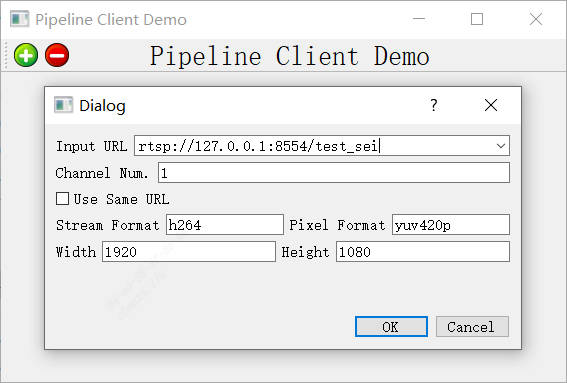

# pipeline_client可视化

## 简介

sophon-pipeline配套客户端，用来显示实时流和检测结果。

## 下载安装

- windows，可使用编译好的[pipeline_client-winx64.zip](http://219.142.246.77:65000/sharing/p5ACNYRoL)
- ubuntu：请自行编译https://github.com/sophon-ai-algo/pipeline_client

## 使用条件

- 客户端(pipeline_client运行的设备)和服务端(sophon-pipeline例程程序运行的设备)必须网络连通：
  1. 端口号配置为一个未被占用的端口(可使用netstat等命令查看)；
  2. 在服务端输入telnet {ip} {port} 测试网络连通；
- 运行可用pipeline_client可视化的例程(video_stitch、cvs10、cvs11不使用pipeline_client)

## 参数说明

使用pipeline_client，需要正确配置视频流的参数。其中，参数说明如下：

| 参数            | 说明                                                         |
| --------------- | ------------------------------------------------------------ |
| `input url`     | 拉流地址。支持`udp`、`tcp`、`rtsp`                           |
| `Channel Num`   | 拉流路数，默认为1                                            |
| `Use Same URL`  | `pipeline_client`内部是否使用所填`input url`进行解析。默认为不使用。**不建议**使用此选项，如果需要使用此选项，需要对`pipeline_client`内部以及`udp`、`tcp`、`rtsp`解析规则有所了解。 |
| `Stream Format` | 拉流的格式。默认为`h264`                                     |
| `Pixel Format`  | 拉流的像素格式，默认为`yuv420p`                              |
| `Width`         | 拉流视频的宽度，默认为1920                                   |
| `Height`        | 拉流视频的高度，默认为1080                                   |

## 运行

**假设运行pipeline_client所在的设备ip为123.45.67.89，端口9527未被占用**

### UDP

1. 启动pipeline_client，填入当前设备的ip和端口：udp://123.45.67.89:9527
2. 服务端配置`.json`的`output_path`参数为udp://123.45.67.89:9527，运行pipeline-sophon例程运行程序
3. 稍等片刻，pipeline_client可见画面

### TCP

1. 必须先启动pipeline_client，填入本机的ip和端口：tcp://123.45.67.89:9527
2. 服务端配置`.json`的`output_path`参数为tcp://123.45.67.89:9527，运行pipeline-sophon例程程序
3. 稍等片刻，pipeline_client可见画面

### RTSP

若使用rtsp，要配合一个rtsp server使用。先推流到rtsp server，pipeline_client再拉流。

rtsp server推荐使用：

开源仓库：https://github.com/aler9/rtsp-simple-server

或者直接下载release可执行程序：https://github.com/aler9/rtsp-simple-server/releases

> **注意：rtsp-simple-server和pipeline_client运行在同一台设备上。且与sophon-pipeline例程程序运行的设备网络连通。**

**具体步骤如下：**(**假设运行rtsp-simple-server和pipeline_client的设备ip为123.45.67.89**)

1. 启动rtsp server：`./rtsp-simple-server`，**默认端口**为`8554`，如果需要修改端口，请自行从`.yml`文件修改，请确保启动前该端口未被占用。
2. 运行sophon-pipeline例程程序，推流到指定rtsp地址：`.json`的`output_path`参数配置为`rtsp://123.45.67.89:8554/abc`
3. 运行pipeline_client，拉流地址指定为`rtsp://123.45.67.89:8554/abc`
4. 稍等片刻，pipeline_client可见画面

> 注意：由于pipeline_client在解析rtsp地址时，在地址末尾会强制附带Channel Num信息，如果显示N路视频，上述实例地址将被解析出N个地址：rtsp://123.45.67.89:8554/abc_{X}，其中{X}为从0到N-1的自然数。如果显示1路视频，上述实例地址将被解析为rtsp://123.45.67.89:8554/abc_0，如果地址配置为rtsp://123.45.67.89:8554，那么pipeline_client将解析为rtsp://123.45.67.89:8554_0，pipeline_client将拉流失败。**因此output必须配置为形如rtsp://{ip}:{port}/{string}，而不能只配置rtsp://{ip}:{port}。**

